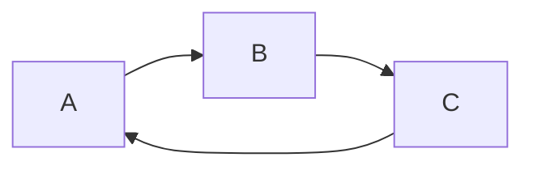

# Extended Markdown

Use `CTRL+SHIFT+M` to show the preview supporting the extended Markdown
- [Markdown Preview Enhanced for Github's *Atom* Editor](https://shd101wyy.github.io/markdown-preview-enhanced/#/)

- [Markdown Preview Enhanced for *VS Code*](https://marketplace.visualstudio.com/items?itemName=shd101wyy.markdown-preview-enhanced): inspired by the Atom package

## Math Typesetting

Use [MathJax, a Javascript Math Lib](https://www.wikiwand.com/en/MathJax): `CTRL+SHIFT+p` to modify its config

[Detailed help](https://shd101wyy.github.io/markdown-preview-enhanced/#/math)

$f(x)=sin(x) + 12$
$$\sum_{n=1}^{100} n$$


## Flowchart and Sequence Diagram

Based on [Mermaid, a Javascript lib](https://knsv.github.io/mermaid/): its github [link](https://github.com/knsv/mermaid)



## More Graphs via Code Chunk

### Not supported on my Windows 10 machine

```{python matplotlib:true, id:"izbp0zt9"}
import matplotlib.pyplot as plt
plt.plot([1,2,3, 4])
plt.show() # show figure
```

```{gnuplot output:"html", id:"chj47mt54y"}
set terminal svg
set title "Simple Plots" font ",20"
set key left box
set samples 50
set style data points

plot [-10:10] sin(x),atan(x),cos(atan(x))
```

```{latex id:"chj47mt550"}
\documentclass{standalone}
\begin{document}
   Hello world!
\end{document}
```


